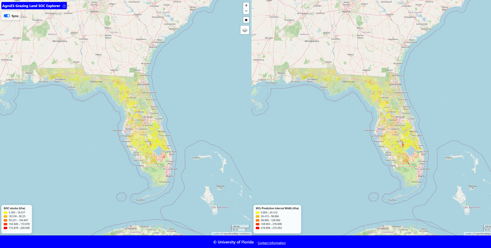

# Spatiotemporal controls on soil organic carbon stocks in subtropical grazing lands: An uncertainty-aware digital soil mapping approach

## Overview

This repository contains the complete code used in the study:

**“Spatiotemporal controls on soil organic carbon stocks in subtropical grazing lands: An uncertainty-aware digital soil mapping approach.”**

Accurate spatial assessment of soil organic carbon (SOC) stocks and their associated uncertainty is essential for understanding terrestrial carbon storage and supporting climate-smart land management. Despite the large spatial extent of grazing systems, SOC storage in these landscapes remains insufficiently characterized, particularly in subtropical regions where environmental controls and management dynamics are highly heterogeneous.

In this study, we developed an **uncertainty-aware digital soil mapping framework** to estimate **topsoil SOC stocks (0–20 cm)** across **Florida’s grazing lands at 30 m spatial resolution** by integrating explainable machine learning, temporally dynamic environmental predictors, and legacy soil observations through data spiking strategies.

Specifically, the framework:

- operationalizes the **STEP–AWBH soil-forming framework** by incorporating spatiotemporal environmental dynamics derived from long-term Earth observation time series, including hydroclimate variability, soil moisture persistence, vegetation phenology, and grazing intensity  
- applies **Quantile Regression Forests** to generate both SOC predictions and calibrated prediction intervals, enabling spatially explicit quantification of predictive uncertainty  
- systematically evaluates the effects of **data spiking strategies** on SOC prediction accuracy and uncertainty calibration

The resulting SOC map estimates **36.11 Tg of SOC stored in the topsoil of Florida’s grazing lands**, with a **mean stock of 20.3 t ha⁻¹**, revealing strong spatial heterogeneity driven by pedological properties, hydroclimatic dynamics, vegetation productivity, and grazing pressure.

All scripts used in data preprocessing, modeling, uncertainty estimation, and visualization are organized as **Jupyter notebooks** to ensure transparency and reproducibility.

---

## Prediction Map


### Interactive Web Application



[](https://es-geoai.rc.ufl.edu/agroes-grazing-soc/)

[](https://zenodo.org/your-doi-link)

## Highlights

- A parsimonious, uncertainty-aware digital soil mapping framework was developed to estimate topsoil SOC stocks in subtropical grazing lands.
- Cross-temporal spiking of legacy soil data substantially improved SOC prediction accuracy and uncertainty calibration.
- Temporal signatures of hydroclimatic, soil moisture, and vegetation phenological dynamics strongly influenced SOC spatial variability.
- SHAP analysis quantified the relative contributions of soil properties, grazing intensity, and temporal environmental controls to SOC stocks.
- High-resolution SOC stock and uncertainty maps provide a robust baseline for carbon monitoring and management in grazing systems.

All workflows are organized as **Jupyter notebooks**, covering the full pipeline including:

- covarible download 
- feaure enginerring
- modeling 
- spatial mapping

---

## How to Begin

```bash
git clone https://github.com/Ecosystem-Services-GeoAI/FL-Grazinglands-SOC.git
cd FL-Grazinglands-SOC

conda env create -f environment.yml
